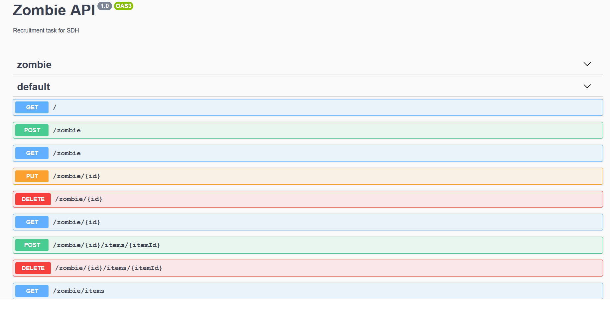

## Installation

```bash
$ npm install
```

## Running the app

```bash
$ npm run start

# watch mode
$ npm run start:dev

# production mode
$ npm run start:prod
```
## Documentation

Feel free to enter ```localhost:3000/``` to check the documentation.


